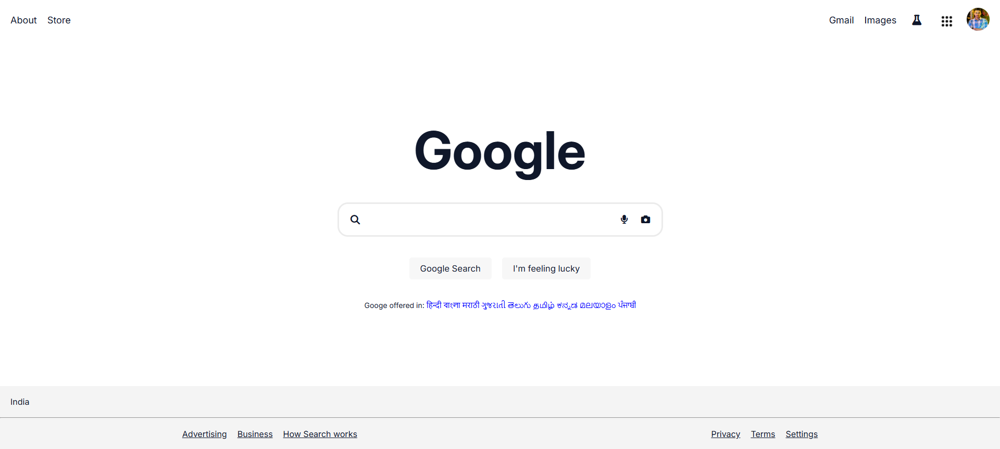

# ⚡ Google Homepage Clone

A simple and responsive **Google Homepage Clone** built using **HTML5** and **CSS3** and **Bootstrap**. This project replicates the UI of Google's main search page, focusing on layout, styling, and responsive design to strengthen front-end development skills.

---

## 🚀 Live Demo

🌐 [Visit the Live Site](https://google-webpage-clone.netlify.app/)

---

## 📸 Screenshots

---

## 📌 Features

- 📱 Responsive Design – Optimized for Mobile, Tablet, and Desktop devices.
- 🎨 Clean & Minimal UI – Simple and modern interface inspired by Google.
- 🔍 Styled Search Bar – Rounded input field with clean styling and focus effects.
- ✨ Interactive Hover Effects – Buttons and links respond smoothly on hover.

---

## 🛠️ Tech Stack

- HTML5 – Structured the webpage content and layout
- CSS3 – Customized styling and UI enhancements
- Bootstrap 5 – Responsive grid system & utility classes

---

## 🧑‍💻 Developer

Saikat Maji
 
🌟 Frontend Developer | Tech Explorer | Passionate Builder
 
🔗
<a href="https://github.com/saikatmaji">GitHub</a> |
<a href="https://www.linkedin.com/in/saikatmaji/">LinkedIn</a>

---

## ⭐ Show Your Support!

- Star this repo
- Fork it
- Contribute
- Share on social media

---

## 🧾 License

This project is for educational purposes only.  
All content, images, and branding belong to [Google](https://www.google.com/).

---
