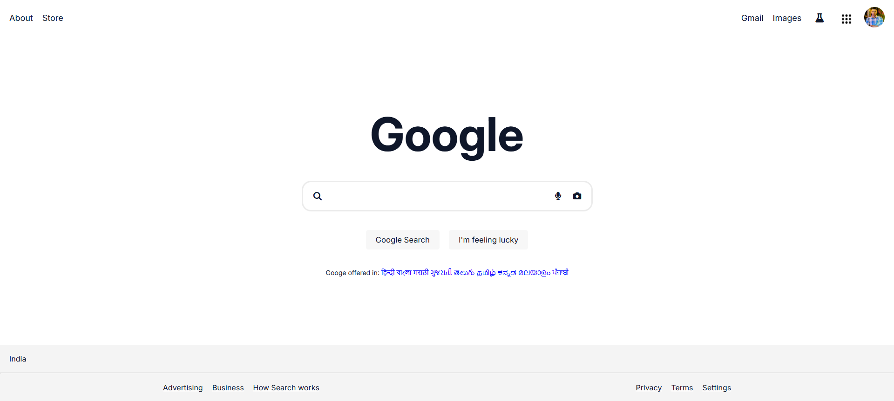

# ⚡ Google Homepage Clone

A simple and responsive **Google Homepage Clone** built using **HTML5** and **CSS3** and **Bootstrap**. This project recreates the visual layout and user interface of Google's homepage, with a focus on responsive design, styling, and front-end development fundamentals.

---

## 🚀 Live Demo

🌐 [Visit the Live Site](https://google-webpage-clone.netlify.app/)

---

## 📸 Screenshots

---

## 📌 Features

- 📱 Responsive Design – Optimized for Mobile, Tablet, and Desktop devices.
- 🎨 Clean & Minimal UI – Simple and modern interface inspired by Google.
- 🔍 Styled Search Bar – Rounded input field with clean styling and focus effects.
- ✨ Interactive Hover Effects – Smooth hover effects on buttons and links for better UX.

---

## 🛠️ Tech Stack

- HTML5 – Structured the webpage content and layout
- CSS3 – Customized styling and UI enhancements
- Bootstrap 5 – Responsive grid system & utility classes

---

## 🧑‍💻 Developer

Saikat Maji
 
Full Stack Developer | Tech Explorer | Passionate Builder
 
<a href="https://github.com/saikatmaji">GitHub</a> |
<a href="https://www.linkedin.com/in/saikatmaji/">LinkedIn</a> |
<a href="https://x.com/saikat__maji">X</a>

---

## ⭐ Show Your Support!

- Star this repository
- Fork the repository
- Contribute to the project
- Share on social media

---

## 🧾 License

This project is for educational purposes only.  
This is an independent front-end practice project and is not affiliated with or endorsed by Google. Google and its related branding are trademarks of Google LLC.

---
